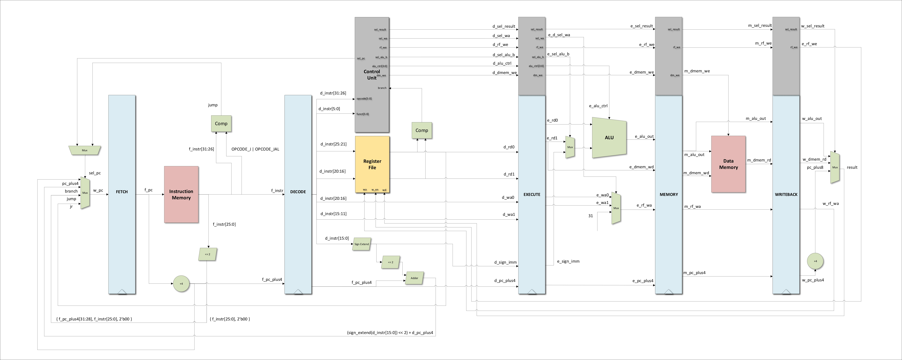

# MIPS-Architecture

A 32-bit single cycle MIPS architecture in SystemVerilog.

## Branches

    master   : Latest version of the design in systemverilog
    verilog  : First version of the design in verilog
    pipeline : Work in progress of converting from single-cycle to pipeline
    
## Instruction Set

    ADD    [R] : R[rd] = R[rs] + R[rt]
    ADDI   [I] : R[rt] = R[rs] + sign_extend(immediate)
    AND    [R] : R[rd] = R[rs] & R[rt]
    BEQ    [I] : PC = (R[rs] == R[rt]) ? (PC + 4) : (PC + 4 + branch_addr)
    DIVU   [R] : $LO = R[rs] / R[rt]; $HI = R[rs] % R[rt]
    JR     [J] : PC = R[rs]
    JAL    [J] : PC = jump_addr; R[31] = PC + 8
    LW     [I] : R[rt] = DMEM[ R[rs] + sign_extend(immediate) ]
    MFHI   [R] : R[rd] = $HI
    MFLO   [R] : R[rd] = $LO
    MULTU  [R] : { $HI, $LO } = R[rs] * R[rt]
    OR     [R] : R[rd] = R[rs] | R[rt]
    SLT    [R] : R[rd] = (R[rs] < R[rt])
    SUB    [R] : R[rd] = R[rs] - R[rt]
    SW     [I] : M[ R[rs] + sign_extend(immediate) ] = R[rt]

## Microarchitecture
